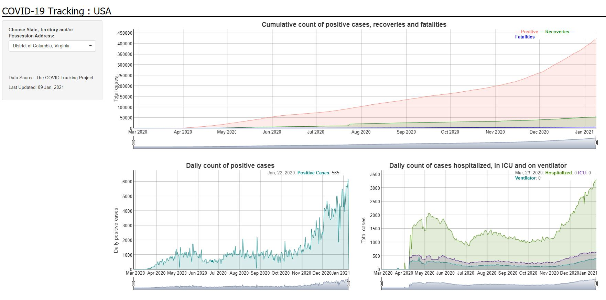

# COVID-19 Tracking : USA

This is a simple Shiny web app to visualize the COVID-19 cases in the United States of America. It is deployed using RStudio's hosting service. The dashboard is updated with data almost regularly.

Data Source: [The COVID Tracking Project](https://covidtracking.com/)

Shiny App URL: https://rmitra.shinyapps.io/covid-tracking/

Screenshot: 
